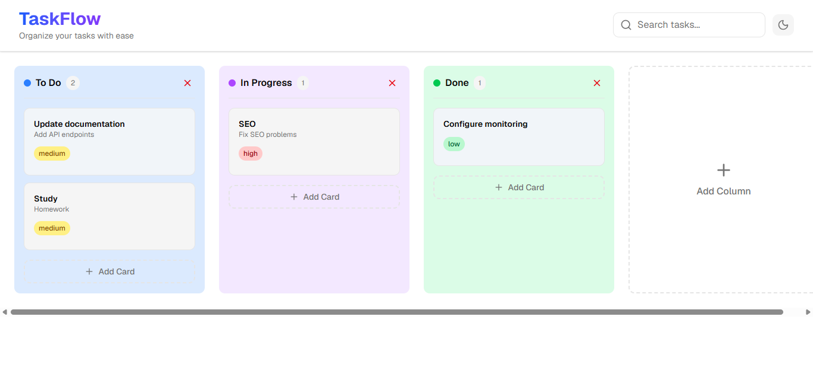
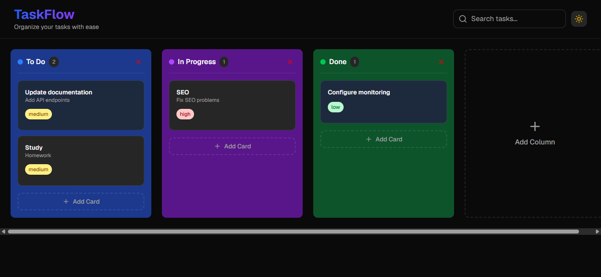
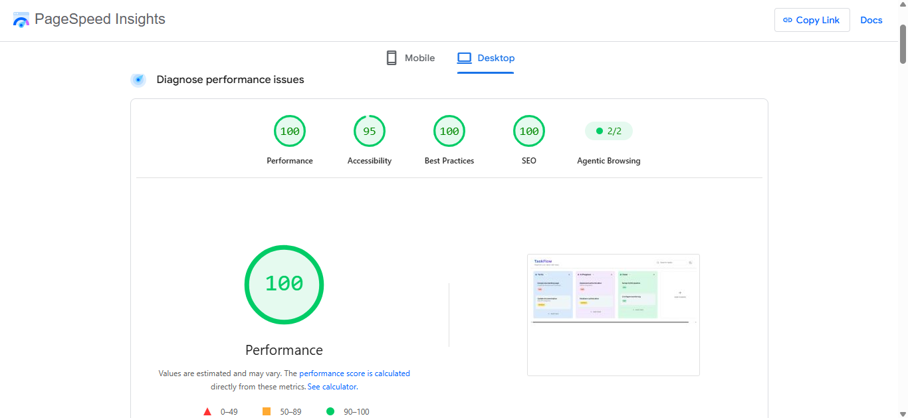

# 📋 TaskFlow – Modern Kanban Board

A modern, responsive **Kanban board** built with **Next.js**, **TypeScript**, **Tailwind CSS**, and **Lucide React**. TaskFlow helps you organize tasks efficiently with a clean interface, dark mode support, and accessibility best practices.

## 🚀 Live Demo

🔗 **https://kanban-app0.vercel.app/**

---

## ✨ Features

- 📌 Create and manage tasks
- 📂 Organize tasks into Kanban columns
- 🗑️ Delete tasks and columns
- 🌙 Light & Dark mode
- 📱 Fully responsive design
- ♿ Accessibility improvements
- ⚡ Fast performance with Next.js App Router
- 🎨 Modern and clean UI

---

## 🛠️ Tech Stack

- **Next.js**
- **TypeScript**
- **Tailwind CSS**
- **Lucide React**

---

## 📸 Screenshots

### ☀️ Light Mode

### 🌙 Dark Mode

### 🚀 Lighthouse Score

---

## 👨‍💻 Author

**Ahmed Talaat**

- GitHub: https://github.com/ahmedtalaat-dev
- LinkedIn: https://linkedin.com/in/ahmedtalaat-dev
